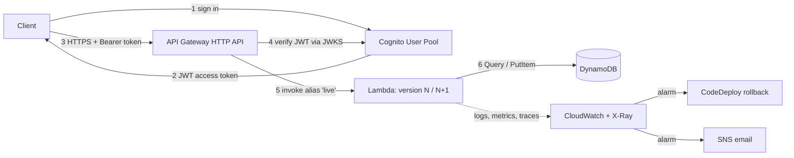

# Serverless REST API with CI/CD and Canary Deployments

[](https://github.com/billy604/serverless-rest-api-cicd.git//actions/workflows/ci.yml)
[](https://github.com/billy604/serverless-rest-api-cicd.git/actions/workflows/deploy.yml)


A per-user task API built on **API Gateway, Lambda, DynamoDB and Cognito**, deployed by a **GitHub Actions pipeline** that lints, tests, scans, and promotes one build artifact from `dev` to `prod` using a **canary release with automatic rollback**. Everything is Terraform. Idle cost is about $0.

> **Part 4 of a 7-project Cloud & DevOps portfolio.** Builds on the Terraform and OIDC patterns from Project 1. See my [profile README](https://github.com/billy604/billy604.git) for the full learning path.

<!-- TODO: add docs/architecture.png (export of the Mermaid diagram below) -->

---

## Table of Contents
1. [What this demonstrates](#what-this-demonstrates)
2. [Architecture](#architecture)
3. [API reference](#api-reference)
4. [Data model](#data-model)
5. [CI/CD pipeline](#cicd-pipeline)
6. [Deployment and rollback](#deployment-and-rollback)
7. [Security model](#security-model)
8. [Testing strategy](#testing-strategy)
9. [Local development](#local-development)
10. [Deploying it yourself](#deploying-it-yourself)
11. [Observability](#observability)
12. [Cost analysis](#cost-analysis)
13. [Demo vs. real production](#demo-vs-real-production)
14. [Design decisions and trade-offs](#design-decisions-and-trade-offs)
15. [What I'd improve for real production](#what-id-improve-for-real-production)
16. [Teardown](#teardown)

---

## What this demonstrates

- **Serverless architecture** with deliberate cost engineering (HTTP API, arm64 Lambda, on-demand DynamoDB, throttling to prevent denial-of-wallet).
- **Authentication and tenant isolation:** Cognito-issued JWTs verified at the gateway; the user identity comes from the verified token, never from the request body. A dedicated unit test proves users cannot access each other's data.
- **Full CI/CD:** PR checks, build-once artifact promotion, per-environment OIDC roles, manual approval gate before prod.
- **Safe releases:** CodeDeploy canary (10% for 5 minutes) with CloudWatch-alarm-driven rollback.
- **DevSecOps:** `ruff`, `mypy`, `bandit`, `checkov`, `tflint`, with every skipped rule documented.
- **Observability:** structured logs with correlation IDs, EMF custom metrics, X-Ray tracing, alarms.

## Architecture



**Request flow**
1. The user signs in to Cognito and receives a signed JWT.
2. The client calls the API with `Authorization: Bearer <access token>`.
3. API Gateway validates the signature, issuer, expiry, and client ID against Cognito's public keys. Invalid tokens get `401` and never reach Lambda (and are not billed for compute).
4. API Gateway invokes the Lambda **alias** `live`, not `$LATEST`. The alias is what makes canary traffic shifting possible.
5. A single Lambda function routes the request (AWS Lambda Powertools router), reads the user ID from the verified claims, and reads/writes DynamoDB.
6. Logs, metrics, and traces flow to CloudWatch and X-Ray.

## API reference

Base URL: the `api_url` Terraform output. All routes except `/health` require a Cognito **access token**.

| Method | Path | Description | Success | Errors |
|---|---|---|---|---|
| GET | `/health` | Liveness + running Lambda version (public) | 200 | |
| POST | `/items` | Create an item | 201 | 400, 401 |
| GET | `/items?limit=25&next_token=...` | List my items (paginated) | 200 | 401 |
| GET | `/items/{id}` | Get one of my items | 200 | 401, 404 |
| PUT | `/items/{id}` | Update title / description / status | 200 | 400, 401, 404 |
| DELETE | `/items/{id}` | Delete an item | 204 | 401, 404 |

Item fields: `title` (1-120 chars, required), `description` (≤1000 chars), `status` (`todo` \| `in_progress` \| `done`). Full contract: [`openapi/api.yaml`](openapi/api.yaml).

**Example (shell commands)**
```bash
# README.md — example session (values come from `terraform output`)
TOKEN=$(aws cognito-idp admin-initiate-auth \
  --user-pool-id "$POOL" --client-id "$CLIENT" \
  --auth-flow ADMIN_USER_PASSWORD_AUTH \
  --auth-parameters USERNAME=me@example.com,PASSWORD='...' \
  --query AuthenticationResult.AccessToken --output text)

curl -s -X POST "$API/items" -H "Authorization: Bearer $TOKEN" \
  -H 'content-type: application/json' -d '{"title":"first task"}'

curl -s "$API/items" -H "Authorization: Bearer $TOKEN"
curl -i "$API/items"        # no token -> 401
```

**Status codes used:** `400` validation error, `401` missing/invalid token, `404` not found *or not yours* (deliberately identical to avoid leaking existence), `429` throttled.

## Data model

Single DynamoDB table, on-demand billing.

| Attribute | Example | Purpose |
|---|---|---|
| `PK` (partition key) | `USER#<cognito sub>` | Groups all of a user's items in one partition |
| `SK` (sort key) | `ITEM#<uuid>` | Unique item within the user |
| `id`, `title`, `description`, `status`, `created_at`, `updated_at` | | Item data |

**Access patterns**

| Need | Operation |
|---|---|
| List my items | `Query` PK = `USER#<sub>`, SK begins_with `ITEM#` |
| Get / update / delete one | `GetItem` / `UpdateItem` / `DeleteItem` by full key |

Why this design: the partition key is built from the **token's `sub` claim**, so tenant isolation is enforced by the key itself. No `Scan` is ever used. Updates and deletes use `attribute_exists(PK)` conditions, so "update if it exists" is atomic and race-free.

A GSI (e.g. items by status) is a deliberate non-goal: each GSI adds write cost, and no current access pattern needs it.

## CI/CD pipeline

```
Pull request ──► ci.yml
                 ├─ python: ruff, mypy, bandit, pytest (coverage ≥ 80%)
                 ├─ iac:    terraform fmt/validate, tflint, checkov
                 └─ plan:   terraform plan (dev) → run summary   [OIDC, read-only role]

Merge to main ─► deploy.yml
                 ├─ package: build Lambda zip ONCE → artifact
                 ├─ dev:  apply → CodeDeploy (all-at-once) → integration tests
                 └─ prod: ⏸ manual approval → apply → CodeDeploy (canary) → integration tests
```

Key properties:
- **Build once, promote the same artifact.** What was tested in dev is byte-for-byte what ships to prod.
- **No long-lived AWS keys.** GitHub Actions assumes an IAM role through OIDC. Trust policies are scoped to this repo and a specific GitHub Environment (`environment:dev` / `environment:prod`), so a job outside that environment cannot assume the role.
- **Separate roles per stage:** PRs use a read-only plan role; each environment has its own deploy role.
- **One reusable workflow** (`_deploy.yml`) is used for both environments, so dev and prod can't drift in how they deploy.
- **Concurrency control:** deployments never run in parallel and are never cancelled midway.

<!-- TODO: screenshot of a green pipeline run with the prod approval gate -->

## Deployment and rollback

Every change publishes an **immutable Lambda version**. A `live` alias points at the active version; CodeDeploy moves it.

1. `terraform apply` publishes version **N+1**. Users still hit N.
2. `scripts/deploy.sh` asks CodeDeploy to shift `live` from N to N+1.
3. **Prod:** 10% of traffic goes to N+1 for 5 minutes (`LambdaCanary10Percent5Minutes`), then 100%. **Dev:** all-at-once, for speed.
4. If the `lambda-errors` alarm fires during the shift, CodeDeploy automatically returns the alias to N and fails the deployment, which turns the pipeline red.

Terraform uses `ignore_changes` on the alias's version and routing config, because CodeDeploy owns them after creation. Without it, every `apply` would fight the canary.

`GET /health` returns the running version, so a canary is visible with `watch -n1 curl -s $API/health`.

<!-- TODO: screenshot or terminal capture of /health flipping between versions -->
<!-- TODO: screenshot of a deliberately broken release being rolled back -->

**Known limitation:** a canary only detects problems that the sampled traffic exercises. With low traffic, a bug may not trigger the alarm. See [Demo vs. real production](#demo-vs-real-production).

## Security model

| Control | Implementation |
|---|---|
| Authentication | Cognito JWT, verified by API Gateway before Lambda runs |
| Authorization / isolation | User ID from verified `sub` claim; part of the DynamoDB key; covered by `test_users_cannot_access_each_others_items` |
| Input handling | Allow-listed fields (no mass assignment); length and enum validation; `limit` capped at 100 |
| Least-privilege runtime role | Lambda can only run 5 DynamoDB actions on one table and write to its own log group |
| CI credentials | OIDC, no stored secrets; trust scoped to repo + environment |
| Abuse / cost protection | API Gateway throttling (10 req/s, burst 20) |
| Secrets in code | None. Test passwords are generated per run and deleted afterwards |
| Static analysis | `bandit` (Python), `checkov` (Terraform) on every PR |

### Documented `checkov` exceptions
Each skip in [`.checkov.yaml`](.checkov.yaml) is a conscious trade-off, listed in the production table below: Lambda outside a VPC, no DLQ, no reserved concurrency, no code signing, AWS-owned encryption keys, short log retention, unencrypted alert topic (CloudWatch alarms cannot publish to a topic encrypted with the AWS-managed key).

## Testing strategy

| Layer | Tooling | Runs | Purpose |
|---|---|---|---|
| Unit | `pytest` + `moto` (in-memory AWS) | Every PR | Business logic, validation, tenant isolation. Fast, free, no credentials |
| Static | `ruff`, `mypy`, `bandit` | Every PR | Style, types, insecure patterns |
| IaC | `terraform validate`, `tflint`, `checkov` | Every PR | Misconfigurations before they exist |
| Integration | `pytest` against the **deployed** API | After each deploy | Real Cognito, API Gateway, DynamoDB. Creates a temporary user, runs CRUD, deletes the user |

Coverage gate: **≥ 80%** (`make test`).

## Local development

**Prerequisites:** Python 3.12, Terraform ≥ 1.10, AWS CLI v2, `make`, `zip`, `jq`.

```bash
# README.md — local workflow
make install    # install dev dependencies
make lint       # ruff, mypy, bandit
make test       # unit tests with coverage gate
make package    # builds build/lambda.zip for Lambda's Linux arm64 target
```

`make package` installs dependencies for the Lambda platform (`manylinux2014_aarch64`), so it works from macOS and Windows too.

## Deploying it yourself

1. **Account hygiene:** enable MFA on the root user, use an admin user (not root), and create an AWS Budget alert.
2. **Bootstrap (once, locally):**
   ```bash
   # README.md — bootstrap state bucket + GitHub OIDC roles
   cd bootstrap
   terraform init
   terraform apply -var github_repo=OWNER/serverless-rest-api-cicd
   ```
   Note the outputs (state bucket, role ARNs). Do not commit the bootstrap state file.
3. **Configure** `infra/envs/{dev,prod}.backend.hcl` with your bucket name.
4. **GitHub setup:** create Environments `dev` and `prod`; add variables `AWS_ROLE_ARN` and `AWS_REGION` to each; add repository variable `AWS_PLAN_ROLE_ARN`; add **required reviewers** to `prod`; protect `main` and require the `ci` checks.
5. **First deploy (manual, to learn the mechanics):**
   ```bash
   # README.md — first manual deploy of dev
   make package
   cd infra
   terraform init -backend-config=envs/dev.backend.hcl
   terraform apply -var-file=envs/dev.tfvars -var lambda_zip_path=../build/lambda.zip
   ```
6. **From then on:** open a PR; merging to `main` deploys.

## Observability

| Signal | Implementation |
|---|---|
| Logs | Structured JSON (Powertools) with API Gateway request ID as correlation ID; API Gateway access logs; 7-day (dev) / 30-day (prod) retention |
| Metrics | Lambda built-ins + EMF custom metrics `ItemsCreated` and `ColdStart` |
| Traces | X-Ray active tracing (default sampling) |
| Alarms | See below |

| Alarm | Condition | Action |
|---|---|---|
| `*-lambda-errors` | ≥ 1 error in 1 minute | SNS email + **triggers CodeDeploy rollback** during a deployment |
| `*-lambda-p95-latency` | p95 > 1000 ms for 2 × 5 min | SNS email |

Both use `treat_missing_data = notBreaching`, so zero traffic is not reported as an outage.

<!-- TODO: add X-Ray trace screenshot and a CloudWatch Logs Insights query example -->

## Cost analysis

Serverless bills per use, so both environments can live in one account at about **$0 while idle**.

| Service | Billing | Demo choice |
|---|---|---|
| API Gateway | per request | HTTP API (cheaper than REST API) |
| Lambda | requests + GB-seconds | arm64, 256 MB, 10 s timeout |
| DynamoDB | per read/write unit | On-demand, no GSI, PITR in prod only |
| Cognito | per monthly active user | Free tier (10,000 MAU on Lite/Essentials) |
| CloudWatch | log ingestion + storage | Short retention |
| X-Ray, SNS, CodeDeploy (Lambda) | | Free tier / no charge at this scale |

Not used because of cost: NAT Gateway, WAF, custom domain, provisioned concurrency, customer-managed KMS keys, VPC.

**Estimate beyond the free tier:** about $1.50-$2 per million requests all-in (my estimate for us-east-1; verify with the AWS Pricing Calculator).

**My actual bill:** <!-- TODO: paste a Cost Explorer screenshot / monthly total after running this for a few weeks -->

## Demo vs. real production

This repository is deliberately optimized for **learning and low cost**. The table shows what I did here, and what I would do on a real team.

| Area | In this demo (cost-optimized) | In a real production team |
|---|---|---|
| **AWS accounts** | One account; `dev` and `prod` separated by resource name prefix | Separate accounts per environment under AWS Organizations, with SCP guardrails |
| **Terraform state** | One S3 bucket, SSE-S3, native locking | Per-account bucket, KMS CMK, access limited to pipeline roles, replication |
| **CI credentials** | OIDC roles per environment, scoped by name prefix (built iteratively from `AccessDenied` errors) | Tighter policies from IAM Access Analyzer, permission boundaries, separate plan/apply roles |
| **Approvals** | One required reviewer on the `prod` environment | CODEOWNERS, 2 approvers, protected branches, change windows, signed commits |
| **Canary** | 10% for 5 min, driven by a Lambda error alarm | Multiple alarms (p99 latency, 5xx, business KPIs), synthetic traffic, linear shifts or feature flags |
| **API type** | HTTP API (cheap; validation done in Lambda) | REST API if I need WAF, usage plans, API keys, caching, or request validation; or CloudFront + WAF in front |
| **Edge security** | Throttling only | AWS WAF (managed + rate-based rules), custom domain with ACM, Shield as needed |
| **Authentication** | Cognito pool, default email sender, no MFA | MFA, SES-branded email, federation with the company IdP, advanced threat protection |
| **DynamoDB** | On-demand, AWS-owned key, PITR in prod only | CMK encryption, PITR everywhere, cross-region backups, global tables if multi-region |
| **Lambda** | No VPC, no DLQ, no reserved/provisioned concurrency, no code signing | VPC if private resources are needed, reserved/provisioned concurrency for latency SLOs, code signing, destinations/DLQ for async paths |
| **Configuration** | Environment variables | SSM Parameter Store / Secrets Manager / AppConfig (feature flags) |
| **Logging** | 7/30-day retention, per-function groups | 90 days to 1+ year per compliance, centralized log-archive account, KMS, SIEM subscription |
| **Alerting** | Two alarms to email | SLO-based alerts, on-call rotation (PagerDuty/Opsgenie), runbooks linked from alerts |
| **Security scanning** | bandit, checkov, ruff | Plus dependency scanning (Dependabot/Renovate), CodeQL, secret scanning, SBOM, GuardDuty/Config/Security Hub |
| **Dependencies** | Version ranges | Lockfile with pinned hashes, private package mirror |
| **Testing** | Unit (moto) + post-deploy integration | Plus contract tests, load tests (k6), DAST, ephemeral per-PR environments |
| **Disaster recovery** | Single region | Documented RPO/RTO, multi-region active-passive, Route 53 failover, restore drills |
| **Cost governance** | Budget alert, tags, short log retention | Cost allocation by tag, anomaly detection, per-team budgets, FinOps reviews |
| **IaC structure** | One repo, one state per environment | Versioned shared modules, state split per component (see Project 6) |

## Design decisions and trade-offs

| Decision | Why | Trade-off |
|---|---|---|
| **HTTP API over REST API** | Lower cost and latency; built-in JWT authorizer | No built-in request validation, WAF, or usage plans |
| **One Lambda with a router** | One IAM role, one alias, one canary, fewer cold-start environments | Larger blast radius per deploy; shared timeout/memory for all routes |
| **Plain-Python validation, no Pydantic** | Smaller package, faster cold starts, simpler cross-platform build | More manual code as models grow |
| **arm64 (Graviton)** | ~20% cheaper per GB-second | Dependencies need arm64 wheels |
| **DynamoDB on-demand** | $0 idle, no capacity planning | More expensive than provisioned at steady high throughput |
| **Terraform per-env tfvars + backend keys, not workspaces** | Always explicit which environment you're targeting | More files; revisited with modules in Project 6 |
| **CodeDeploy for canary** | No extra cost for Lambda; alarm-driven rollback | Extra moving parts (service role, deployment group) |
| **S3 native state locking** | No lock table to run | Requires Terraform ≥ 1.10 |

Cold starts: with Python on arm64 and a small package, cold starts are modest, and this API tolerates them. Latency-critical paths would use provisioned concurrency or SnapStart-style mitigations where supported.

## What I'd improve for real production

- Move `dev` and `prod` into **separate AWS accounts** and manage them via a reusable module platform (Project 6).
- Put **CloudFront + AWS WAF** in front of the API, with a custom domain and ACM certificate.
- Add **synthetic canary traffic** (CloudWatch Synthetics) so the canary window is meaningful even at low real traffic.
- Replace env-var config with **SSM Parameter Store/AppConfig**, and encrypt data and logs with **customer-managed KMS keys**.
- Add **SLO-based alerting**, dashboards, and an on-call integration, with a runbook for each alarm.
- Add **load testing** (k6), **dependency and secret scanning**, and per-PR ephemeral environments.
- Tighten CI role policies using **IAM Access Analyzer** and add a **permissions boundary**.

## Teardown

```bash
# README.md — destroy an environment (repeat for dev and prod)
cd infra
terraform init -reconfigure -backend-config=envs/prod.backend.hcl
terraform destroy -var-file=envs/prod.tfvars -var lambda_zip_path=../build/lambda.zip
```
- `prod` has **deletion protection** on the DynamoDB table and Cognito pool. Set it to off in the code and apply once before destroying.
- Destroy the bootstrap resources last (empty the versioned state bucket first).
- Confirm in the Billing console that nothing is left running.

---

## Repository layout

```
serverless-rest-api-cicd/
├── .github/workflows/        # ci.yml, deploy.yml, _deploy.yml
├── bootstrap/main.tf         # one-time: state bucket + OIDC roles
├── infra/                    # Terraform: API, Lambda, DynamoDB, Cognito, alarms, CodeDeploy
│   └── envs/                 # {dev,prod}.tfvars and backend configs
├── src/                      # app.py, models/item.py, utils/db.py
├── tests/                    # unit/ and integration/
├── scripts/deploy.sh         # CodeDeploy traffic-shift helper
├── openapi/api.yaml          # API contract
├── docs/                     # architecture diagram, decisions, runbook
├── .checkov.yaml  .tflint.hcl
├── requirements*.txt  pyproject.toml  Makefile
└── README.md
```

## License
MIT